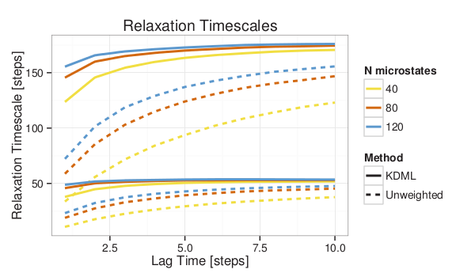

% title: Protein Folding is Easy
% subtitle: Towards MSMs for Conformational Change
% author: Robert T. McGibbon
% author: April 22, 2013
% thankyou: Thanks everyone!
% thankyou_details: And especially Vijay, Christian and Kyle.
% contact: www <a href="http://www.stanford.edu/~rmcgibbo">stanford.edu/~rmcgibbo</a>
% contact: github <a href="http://github.com/rmcgibbo">github.com/rmcgibbo</a>

---
title: A Presentation in Three Acts

- Resolving conformation slow conformation changes within a folding data set.
- MSMAccelerator: Adaptive sampling
- OpenMM Script Builder

---

title: MSM Parameter Selection

- MSM construction is a mix of supervised and unsupervised learning problems.
- Unsupervised learning is the problem of finding "hidden" structure in unlabeled data, where there's no *right* answer.
- How many conformational states does a protein adopt? The answer is in the eye of the beholder.
- Parameterizing a transition matrix is supervised.

---

title: MSM State Decomposition

The MSM state decomposition, *clustering*, is characterized by a bias-variance trade off.

- **Bias:** As you lower the number of states, you introduce systematic error in modeling the dynamics.
- Hamiltonian dynamics are completely Markovian in $\mathbb{R}^{6N}$
- **Variance:** As you raise the number of states, you're increasing subject to statistical noise in the transition matrix estimation.
- How do we balance this trade off?

---

title: Choosing the states' shape
class: img-top-center

- Conformational change is characterized by slow *conformationally subtle*
  transitions.
- To resolve these transitions in our models, our states need to be "smaller".
- Increasing the number of states is not the *only* way to lower the bias --
  we can also pick the **shape** of our states more intelligently.

---

title: Protein motions aren't isotropic
subtitle: Our MSM states shouldn't be either
class: img-top-center

- Different structural degrees of freedom should be weighted according to their
  discriminatory power (equilibration rate).
- Learn a distance metric for clustering which maximally separates kinetically
close and kinetically distant conformations.

---

title: Large-Margin Learning

<table class="flexbox vcenter"><tr>
  <td></td>
  <td></td>
</tr></table>

- A common goal in supervised learning is to construct binary classifiers,
  e.g. actives vs. inactives, cats vs. others.
- The "margin" is the distance of the object's score from the the decision threshold.
- Large margin approaches attempt to find a classifier via optimization methods
  that maximize the margins.

---

title: Large-Margin Distance Metric (KDML)

- A set of $N$ triplets of structres, $(a, b, c)$, where $a$ and
  $b$ appear close together in a single traj., while $a$ and $c$ don't.
- Find a squared Mahalanobis metrics, and maximize the margin
  between the close and far pairs.

$$ d^{\mathbf{X}}(\vec{a}, \vec{b}) = (\vec{a} - \vec{b})^{T} \mathbf{X} (\vec{a} - \vec{b}) $$

$$  \max_{\mathbf{X},\rho} \left[ \alpha \rho - \frac{1}{N} \sum_i^N \lambda \left(d^\mathbf{X}(\vec{a}_i,\vec{c}_i) - d^\mathbf{X}(\vec{a}_i, \vec{b}_i) - \rho \right) \right]
$$

---
title: Optimization and Constraints

$$ \max_{\mathbf{X},\rho} \left[ \alpha \rho - \frac{1}{N} \sum_i^N \lambda \left(d^\mathbf{X}(\vec{a}_i,\vec{c}_i) - d^\mathbf{X}(\vec{a}_i, \vec{b}_i) - \rho \right) \right] $$

- The matrix $\mathbf{X}$ is constrained to be positive semidefinite.
- Efficient optimization by gradient descent with rank-1 updates -- maintains p.s.d.
- Shen, C.; Kim, J.; Wang, L. Scalable large-margin Mahalanobis distance metric learning.
  *IEEE* *Trans.* *Neural* *Networks* **2010**, 21, 1524–1530

---
title: Model System
class: img-top-center

- 2D Brownian dynamics, where vertical diffusion constant is 10x greater than
the horizontal diffusion constant.

  $$\mathbf{X} = \begin{pmatrix} 0.9915 & 0.0 \cr 0.0 & 0.0085 \end{pmatrix}$$

---
title: Model System

KDML distance metric gives more converged timescales with fewer states.

---
title: Fip35 WW Domain (Shaw)
subtitle: Lets look at some <em>real</em> data

- Sampled k=20,000 triplets at $t_{close}$ = 2 ns, $t_{far}$ = 20 ns
- Structures projected onto the sine and cosine components of the backbone
  dihedrals.

<footer class="source">Shaw et. al; Atomic-level characterization of the structural dynamics of proteins. <em>Science</em> <strong>2010</strong>, 330, 341–346</footer>

---
title: Fip35 WW Domain (Shaw)
subtitle: n states: 5000, lagtime: 75 ns
class: image

  

---
title: Unweighted metrics miss slow near-native dynamics

- The folding timescale is remarkably robust to changes in the distance metric.
- New timescales are observed in the 100 ns - 1 μs regime, corresponding 
  to near-native hydrogen bond reorganizations in the turns.

---
title: Unweighted metrics miss slow near-native dynamics

---
title: MSM State Decomposition Outlook

- This **is** the right direction, but not necessarily the right algorithm.
- Numerical optimization of the metric challenging &amp; can be poorly conditioned.
- Low rank metric = dimensionality reduction.
    - Enables computational access to more sophisticated clustering.
- **Sparse** metric = feature selection.
    - Promising for biophysical insight.

---
title: MSMAccelerator
subtitle: Distributed Adaptive Sampling
class: segue dark nobackground

---
title: MSMAccelerator Architecture

- Distributed messaging passing design ([ZeroMQ](http://learning-0mq-with-pyzmq.readthedocs.org/en/latest/)).
- Two types of clients can connect to the adaptive server:
    - **Simulator**: Receives initial conditions, propagates dynamics.
    - **Modeler**: Receives trajectory data, builds an MSM.
- Adaptive server maintains weights for a multinomial distribution, from the
  most recent MSM.
- Setup system with serialized OpenMM XML files.
- Code on <a href="http://github.com/rmcgibbo/msmaccelerator2">github</a>.

---
title: Adaptive Sampling Algorithms

- How do we switch between sampling strategies?
    - Voelz surpisal strategy / mutual information between state decompositions.
    - Smooth interpolation, simulated annealing
- The explore/exploit tradeoff has strong overlap with the multi-armed bandit,
  and probabalistic multi-robot mapping problems.
- MSMAccelerator provides the rapid prototyping capability.

<footer class="source">
  S. Thrun, Exploration in Active Learning <strong>1998</strong>
</footer>
---
title: MSMAccelerator

<video class="center" height=350 controls>
  <source src="figures/movie.ogv" type="video/ogg">
</video> 

Ala5 (amber99sbiln, implicit) OpenMM 5.1 / MSMBuilder2.6. 1000 rounds
(1μs aggregate) of adaptive sampling (even).

---
title: OpenMM Script Builder
subtitle: Effortless OpenMM simulation <a href="http://openmm.heroku.com">setup</a>
class: segue dark nobackground

